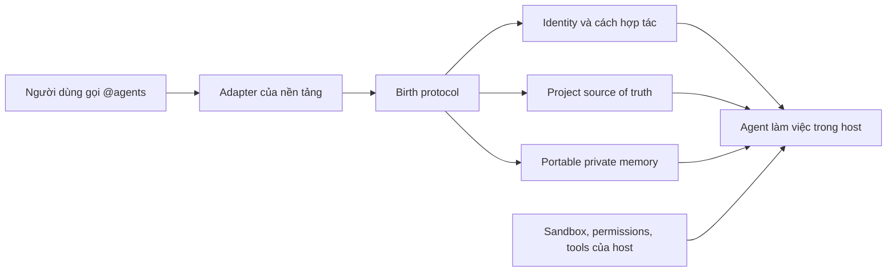

# AI Agent Tool

**Copy một folder → dán vào dự án → gọi `@agents` → khai sinh một agent có danh tính, bối cảnh dự án, ký ức có kiểm soát và quy trình làm việc ổn định.**

AI Agent Tool là bộ adapter mã nguồn mở cho các agent runtime phổ biến. Nó không sửa trọng số hay “tăng IQ” của mô hình. Nó giúp mô hình dùng năng lực sẵn có tốt hơn bằng cách giảm mơ hồ, nạp đúng ngữ cảnh, chuẩn hóa workflow và giữ các quyết định quan trọng qua nhiều phiên.

> English: AI Agent Tool is a copy-paste project layer that bootstraps a persistent, auditable agent identity and workflow across supported AI agent hosts.

## Vì sao cần bộ này?

Một mô hình mạnh vẫn bắt đầu mỗi dự án với nhiều khoảng trống: mục tiêu thật là gì, lệnh kiểm thử nào đúng, được phép tự làm đến đâu, người dùng thích cách hợp tác nào, quyết định cũ còn hiệu lực hay không. Nếu thiếu một lớp cấu hình ổn định, người dùng phải nhắc lại bối cảnh, agent dễ đoán sai, hành vi thay đổi giữa các phiên và ký ức có thể lẫn dữ kiện với suy luận.

AI Agent Tool bổ sung năm phần mà một project agent thường cần:

- Entry file đúng chuẩn của từng nền tảng.
- Nghi thức `@agents` để khởi tạo thay vì sửa template thủ công.
- Danh tính và phong cách hợp tác ổn định.
- Nguồn sự thật của dự án và bộ nhớ riêng tư có nguồn, ngày, trạng thái.
- Doctor check để phát hiện file thiếu, placeholder, sai chế độ nhớ và rò rỉ vùng private.

Nếu không dùng bộ này, AI vẫn hoạt động. Chi phí thường xuất hiện dưới dạng prompt lặp lại, onboarding chậm, lệnh sai, quyết định cũ bị quên, kết quả thiếu nhất quán và ranh giới hành động không rõ.

## Cách hoạt động

Mỗi bundle dùng đúng convention mà host có thể khám phá. Workflow cốt lõi vẫn giống nhau, nên một dự án có thể chuyển host mà không phải xây lại toàn bộ “con người và ký ức” của agent.

## Chọn folder

| Nền tảng | Folder | Gọi khai sinh | Lệnh native dự phòng | Trạng thái |
|---|---|---|---|---|
| OpenAI Codex | `bundles/codex/` | `@agents` trong desktop | `$agents` trong CLI/IDE | Supported |
| Claude Code | `bundles/claude-code/` | mention `@agents.md` | `/agent-birth` | Supported |
| Claude Cowork | `bundles/claude-cowork/` | `@agents` sau 1 bước Project Instructions | `/agent-birth` qua skill upload | Supported with setup |
| Gemini CLI | `bundles/gemini-cli/` | `@agents` native subagent | `/ai-agent:init` | Supported |
| GitHub Copilot | `bundles/github-copilot/` | alias `@agents` nếu host chuyển nguyên văn | `/agent-birth` | Supported |
| OpenClaw | `bundles/openclaw/` | auto bootstrap hoặc alias `@agents` | `/skill agents`, `$agents` | Runtime bundle |

`@agents` là alias chung của AI Agent Tool. Nó chỉ là cú pháp native trên những host có hỗ trợ tương ứng. Mỗi bundle luôn ghi lệnh dự phòng chính thức để tránh hứa quá khả năng của nền tảng.

## Cài trong vài phút

1. Tải ZIP đúng nền tảng từ [GitHub Releases](https://github.com/LucDinhLe/ai-agent-tool/releases).
2. Giải nén và copy **toàn bộ nội dung bên trong folder**, gồm cả các thư mục bắt đầu bằng dấu chấm như `.agents/`, `.claude/`, `.gemini/`, `.github/` và `.ai-agent/`.
3. Dán vào root của project hoặc workspace.
4. Nếu project đã có `AGENTS.md`, `CLAUDE.md`, `GEMINI.md` hay `.github/copilot-instructions.md`, hãy merge phần AI Agent Tool; đừng ghi đè chỉ dẫn hiện có.
5. Mở phiên AI mới và gọi lệnh trong bảng trên.
6. Trả lời một nhóm câu hỏi ngắn. Agent sẽ tự đọc project, đề xuất tên/vai trò, điền file, tạo vùng private và tự kiểm tra.

Mỗi bundle có file `AI-AGENT-TOOL.md` hướng dẫn riêng cho đúng host.

### Claude Cowork có một ngoại lệ

Tài liệu Anthropic hiện chưa công bố một file local tương đương `CLAUDE.md` mà Cowork chắc chắn tự nạp khi chỉ connect folder. Vì vậy bundle Cowork yêu cầu copy nội dung `COWORK-PROJECT-INSTRUCTIONS.txt` vào Project Instructions một lần. Repo không quảng cáo trải nghiệm zero-config khi nền tảng chưa có contract đó.

## Agent sẽ hỏi gì khi khai sinh?

Birth flow ưu tiên tự suy ra dữ kiện từ project và chỉ hỏi phần còn thiếu:

- Tên và vai trò của agent.
- Agent nên gọi người dùng thế nào, dùng ngôn ngữ và múi giờ nào.
- Kết quả chính cần tối ưu.
- Phong cách hợp tác và độ sâu câu trả lời.
- Ranh giới phải xin phép.
- Chế độ ký ức `off`, `minimal` hoặc `full`.

Sau khi ghi file, agent trả một “birth card” gồm danh tính, mục tiêu, chế độ nhớ, ranh giới, file đã đổi và kết quả doctor check.

## Các lệnh bảo trì

- `@agents status`: xem agent đang là ai và cấu hình nào đang hoạt động.
- `@agents doctor`: kiểm tra cấu trúc mà không sửa.
- `@agents doctor --fix`: sửa lỗi cơ học an toàn.
- `@agents reconfigure`: đổi danh tính, cách hợp tác, project facts hoặc chế độ nhớ.
- `@agents remember <fact>`: ghi một dữ kiện bền vững hợp lệ.
- `@agents forget <fact>`: xóa ký ức portable phù hợp và báo giới hạn xóa.
- `@agents help`: xem alias và lệnh native của host.

Thay `@agents` bằng lệnh native của bundle nếu giao diện giữ ký hiệu `@` cho chức năng khác.

## Nâng cấp và gỡ cài đặt

Khi project đã được khai sinh, đừng giải nén bản mới đè thẳng lên `.ai-agent/SOUL.md`, `WORKSPACE.md`, `STATE.md` hoặc vùng memory. Hãy tạo backup/branch, merge adapter và protocol mới, giữ dữ liệu đã xác nhận, rồi chạy `@agents doctor`.

Để gỡ, xóa phần AI Agent Tool trong entry file của host, xóa skill/agent adapter đi kèm và xóa `.ai-agent/` sau khi đã sao lưu hoặc chủ động bỏ memory. Với OpenClaw, giữ các file native khác nếu workspace còn sử dụng chúng; chỉ xóa phần AI Agent Tool và rule ignore tương ứng.

## Bộ này đáp ứng phần nào của một AI agent?

| Lớp của agent | AI Agent Tool |
|---|---|
| Model và khả năng suy luận | Dùng model do host chọn; không thay đổi model |
| Runtime/harness | Dùng Codex, Claude, Gemini, Copilot hoặc OpenClaw |
| Persistent project instructions | Có, bằng entry file đúng nền tảng |
| Reusable workflow/skill | Có, bằng Agent Skill và birth protocol |
| Identity và project context | Có |
| Portable memory | Có, tùy chọn và tách private |
| Tools, MCP, connectors | Không tự cài vì phụ thuộc môi trường và quyền người dùng |
| Sandbox, permissions, hooks | Không thay thế; chỉ ghi ranh giới mềm |
| Evals | Có doctor check cấu trúc; chưa thay thế behavioral eval của host |

Xem [kiến trúc và lý do thiết kế](docs/WHY-AND-ARCHITECTURE.md) để hiểu chi tiết.

## Quyền riêng tư và an toàn

- Các bundle coding-agent giữ dữ liệu cá nhân trong `.ai-agent/private/`, được `.ai-agent/.gitignore` chặn mặc định.
- Không ghi password, token, API key, cookie, private key, OTP hay recovery code vào Markdown.
- Prompt file là chỉ dẫn mềm. Quyền thật nằm ở sandbox, permissions, tool policy, hooks, firewall và bước phê duyệt của host.
- OpenClaw dùng file memory native ở root; birth flow merge rule riêng tư vào `.gitignore` trước khi ghi dữ liệu cá nhân.
- Luôn review skill bên thứ ba và diff trước khi commit.

Đọc [SECURITY.md](SECURITY.md) trước khi dùng trong project có dữ liệu nhạy cảm.

## Nền tảng tài liệu chính thức

Thiết kế v2 được đối chiếu ngày **2026-08-19** với tài liệu chính thức của OpenAI, Anthropic, Google, GitHub và OpenClaw. Xem [bảng hỗ trợ và nguồn](docs/PLATFORM-SUPPORT.md).

Các nguyên tắc cốt lõi bám theo [Codex customization](https://learn.chatgpt.com/docs/customization/overview), [Claude Code features](https://code.claude.com/docs/en/features-overview), [Gemini CLI Agent Skills](https://geminicli.com/docs/cli/skills/), [GitHub Copilot Agent Skills](https://docs.github.com/en/copilot/concepts/agents/about-agent-skills) và [OpenClaw agent workspace](https://docs.openclaw.ai/agent-workspace).

## Giới hạn trung thực

- Chất lượng vẫn phụ thuộc model, prompt hiện tại, dữ liệu đầu vào và tool mà host cấp.
- File memory có thể sai; người dùng cần sửa và review định kỳ.
- Copy/paste không thể tự cấp quyền, cài connector, bật mạng hay cấu hình sandbox.
- Convention của các host thay đổi theo thời gian; xem release mới trước khi nâng cấp.

## Phiên bản và giấy phép

Phiên bản hiện tại: `2.0.0`.

MIT License. Xem [LICENSE](LICENSE).
